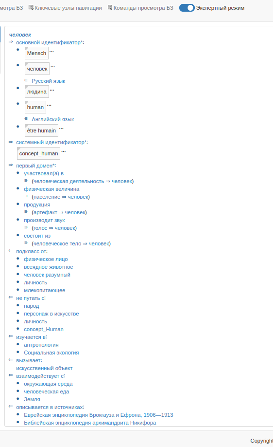

# KB-generator
WikiData to SCs parser

# How to use

To start program you can enter this command into terminal:
```shell
gradle run
```

Or you can just open IntellijIDEA and click on the grin arrow in org.artrayme.ui.swing.MainWindow class

After that, enter some names of your entities and enter the languages for which you want to get identifiers. Sometimes it is better to enter more than 1 language.

# Example
Example of generated knowledge base:


# In development 

1) Translation. All logic for translation already implemented, but only with Free Google Translator. And this translator ban your ip if there is a lot of requests. To solve this issue, user must provide token for Google cloud translator. Or another option -- implement client for LibreTranslate. 
2) Mapping relations. Ostis and Wiki have different name for identical relations. And it is important to add converter wiki2ostis names

# Contribution
Any questions? Create an issue! 

If you want to add something to the project, simply create a pull request)
